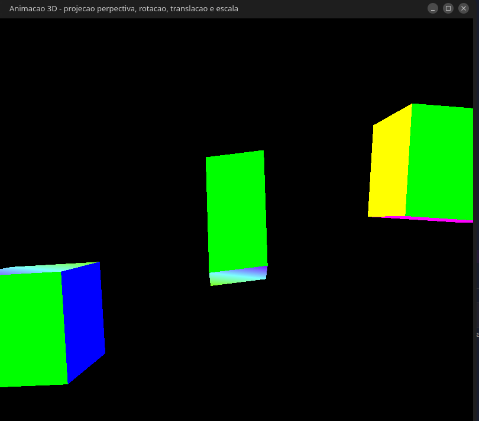

# Animação 3D - Projeção Perspectiva (Frustrum), Escala, Rotação e Translação

Este documento fornece uma documentação/explicação sobre o código 
elaborado e um detalhamento dos recursos utilizados para realizar o mesmo, bem como seu resultado
e as fontes utilizadas para produzi-lo.

## Autores: 

####  Victor Lelis

#### Matheus Vieira

#### Victor Ramires

## Requisitos

Para executar o código, você precisará ter as seguintes bibliotecas instaladas:

- GLFW: Uma biblioteca para criar janelas com contexto OpenGL.
- GLEW: Uma biblioteca para gerenciar extensões OpenGL.
- GLM: Uma biblioteca para matemática para OpengGL.
- Um compilador C++ compatível com C++11.

Para instalar os recursos necessários em uma distribuição `linux` baseada em `debian`,
execute:
`sudo apt-get install libgl1-mesa-dev xorg-dev mesa-utils libglu1-mesa-dev freeglut3-dev mesa-common-dev libglew-dev libxmu-dev libxi-dev libglfw3 libglfw3-dev`

## Variáveis Globais

- `programId`: Um identificador para o programa OpenGL.
- `cubeVAO`: Um identificador para o Vertex Array Object (VAO) do cubo.
- `indexOffSet`: Um deslocamento de índice para o buffer.
- `matrixId`: O identificador para a matriz no shader.
- `projection`: Uma matriz de projeção.
- 
  `float escalaMin` : Esta variável representa o fator de escala mínimo, que será aplicado a um dos cubos. 
- `float escalaMax` : Esta variável representa o fator de escala máximo, que será aplicado a um dos cubos.
- `float escalaAtual` : A variável `escalaAtual` mantém o valor atual do fator de escala. Inicialmente, ela é definida como 1.0, o que significa que não há ampliação ou redução.
- `float incremento` : Esta variável `incremento` especifica quanto a escala deve ser alterada a cada iteração. No caso, o valor é 0.01, o que sugere um aumento ou diminuição gradual da escala.
- `bool aumentando` : Aqui, temos uma variável booleana `aumentando`, que define a direção inicial da mudança de escala. Quando é `true`, significa que a escala está aumentando no início. Se for `false`, indica que a escala está diminuindo no início.

## Funções

### `ReadProgramSource(const std::string filePath)`

Esta função lê o código-fonte do shader de um arquivo e retorna uma string 
contendo o código.

### `CompileAndLinkShaders()`

Essa função cria, compila e vincula shaders (vertex e fragment shaders) para 
criar um programa OpenGL. Ele usa os shaders localizados em "./shaders/Main.vert" e 
"./shaders/Main.frag". Os shaders são vinculados ao `programId`.

### `criaCubo()`

A função `criaCubo()` é responsável por criar um cubo 3D para ser renderizado no 
contexto OpenGL. Esta função define os vértices, cores e índices do cubo e configura 
os buffers e o `Vertex Array Object (VAO)` necessários para renderização. Vamos examinar o 
funcionamento detalhado dessa função:

Definição de Vértices, Cores e Índices:

Dentro da função, são definidos os vértices do cubo, as cores para cada face do cubo e os índices que determinam a ordem dos vértices para formar os triângulos que compõem o cubo. Os vértices são armazenados em um array vertices, as cores em um array colors, e os índices em um array indices. Cada vértice possui uma posição tridimensional (x, y, z), e as cores são definidas como valores RGB.

Geração de Buffers:

A função chama glGenVertexArrays() e glGenBuffers() para gerar identificadores para o VAO e um buffer. Esses identificadores são armazenados em cubeVAO e BufferId, respectivamente.

Configuração do Buffer:

A função chama glBindBuffer(GL_ARRAY_BUFFER, BufferId) para fazer com que o buffer BufferId seja o buffer atual. No entanto, neste momento, o buffer ainda não foi preenchido com dados.

Preenchimento do Buffer:

Os dados (vértices, cores e índices) são inseridos no buffer usando a função glBufferSubData(). Isso é feito em três etapas consecutivas:

Os vértices são copiados para o buffer na posição currentOffSet do buffer.
As cores são copiadas para o buffer na posição currentOffSet após os vértices.
Os índices são copiados para o buffer na posição currentOffSet após as cores.
O deslocamento currentOffSet é atualizado a cada etapa para garantir que os dados sejam colocados nas posições corretas do buffer.

Definição do indexOffSet:

Após a cópia dos índices no buffer, o valor de indexOffSet é definido como o valor atual de currentOffSet, indicando onde começam os índices no buffer.

Configuração do VAO:

O VAO é vinculado usando glBindVertexArray(cubeVAO). Dentro deste bloco, as seguintes 
operações são realizadas:

O buffer de elementos (índices) é vinculado ao VAO usando glBindBuffer(GL_ELEMENT_ARRAY_BUFFER, BufferId).
O buffer com os dados dos vértices é vinculado ao VAO usando glBindBuffer(GL_ARRAY_BUFFER, BufferId).
Configuração de Atributos de Vértice:

Nesta etapa, são configurados os atributos de vértice para o VAO. Isso inclui a posição dos vértices e as cores. Os seguintes passos são executados:

O atributo de posição (0) é ativado usando glEnableVertexAttribArray(0), e sua configuração é definida com glVertexAttribPointer(), indicando que os dados de posição são compostos por 3 valores de ponto flutuante.
O atributo de cor (1) é ativado usando glEnableVertexAttribArray(1), e sua configuração é definida com glVertexAttribPointer(), indicando que os dados de cor são compostos por 3 valores de ponto flutuante sem normalização.
Desvinculação do VAO:

Após a configuração dos atributos de vértice, o VAO é desvinculado com glBindVertexArray(0).

### `inicializaOpenGL()`

Inicializa o OpenGL, chama `criaCubo()` para criar o cubo, chama `CompileAndLinkShaders()` para compilar e vincular os shaders, configura a matriz de projeção e obtém o identificador da matriz no shader.

### `desenha(float dt)`

Esta função é responsável por desenhar o cubo na tela. Ela aplica transformações matriciais aos cubos e, em seguida, desenha-os usando os shaders vinculados. O `dt` é usado para animar os cubos.

#### Transformações Aplicadas no cubo do meio
1. `glm::mat4 model = glm::rotate(glm::mat4(1.f), +dt, glm::vec3(0.f, 1.f, 0.f));`
  - Rotaciona o objeto no eixo Y por uma quantidade de `dt` radianos.

2. `model = glm::scale(glm::mat4(1.0f), glm::vec3(escalaAtual/2, escalaAtual, escalaAtual/4));`
  - Aplica uma escala ao objeto nos três eixos, com os fatores de escala determinados por `escalaAtual`.

3. `model = glm::rotate(model, 1.75f * dt, glm::vec3(1.f, 0.f, 0.f));`
  - Rotaciona o objeto no eixo X por uma quantidade de `1.75 * dt` radianos.

4. `model = glm::rotate(model, 0.75f * dt, glm::vec3(0.f, 0.f, 1.f));`
  - Rotaciona o objeto no eixo Z por uma quantidade de `0.75 * dt` radianos.

5. `glm::mat4 finalMatrix = projection * model;`
  - Combina a matriz de projeção com a matriz de modelo, levando o objeto do espaço do mundo para o espaço de projeção.

#### Transformações Aplicadas no cubo da esquerda

1. `model = glm::rotate(glm::mat4(1.f), -dt, glm::vec3(0.f, 1.f, 0.f));`
  - Rotação: Rotaciona a matriz `model` em torno do eixo Y por um ângulo negativo `dt` de radianos.

2. `model = glm::translate(model, glm::vec3(-2.0f, -0.99f, 0.f));`
  - Translação: Translada a matriz `model` nas direções X e Y por -2.0f e -0.99f, respectivamente.

3. `model = glm::rotate(model, 1.75f * dt, glm::vec3(0.f, 1.f, 0.f));`
  - Rotação: Rotaciona a matriz `model` em torno do eixo Y por um ângulo de 1.75 vezes `dt` de radianos.

4. `model = glm::rotate(model, 0.75f * dt, glm::vec3(0.f, 0.f, 1.f));`
  - Rotação: Rotaciona a matriz `model` em torno do eixo Z por um ângulo de 0.75 vezes `dt` de radianos.

5. `finalMatrix = projection * model;`
  - Composição: Combina as matrizes `projection` e `model` multiplicando-as para transformar os objetos do espaço do modelo para o espaço de projeção.

#### Transformações Aplicadas no cubo da direita

1. `model = glm::rotate(glm::mat4(1.f), -dt, glm::vec3(0.f, -1.f, 0.f));`
  - Rotação do modelo em torno do eixo y negativo por um ângulo de -dt.

2. `model = glm::translate(model, glm::vec3(2.0f, 0.5f, 0.f));`
  - Translação do modelo no espaço em 2 unidades ao longo do eixo x, 0.5 unidades ao longo do eixo y, e 0 unidades ao longo do eixo z.

3. `model = glm::rotate(model, 1.75f * dt, glm::vec3(0.f, -1.f, 0.f));`
  - Rotação adicional do modelo em torno do eixo y negativo por um ângulo de 1.75 * dt.

4. `model = glm::rotate(model, 0.75f * dt, glm::vec3(0.f, 0.f, -1.f));`
  - Rotação adicional do modelo em torno do eixo z negativo por um ângulo de 0.75 * dt.

5. `finalMatrix = projection * model;`
  - Combinação da matriz de projeção com a matriz de modelo para obter a matriz final usada na renderização, que leva o modelo do espaço do mundo para o espaço de projeção.

### `main()`

A função `main()` inicia o GLFW, cria uma janela, inicializa o OpenGL, inicia um loop de renderização e, finalmente, libera os recursos após o término do programa.

###  Projeção
A projeção utilizada foi a projeção perspectiva (Frustrum), a função utilizada foi retirada da biblioteca `glm`, a função `glm::perspective(glm::radians(45.f), 800.f / 680.f, 0.1f, 10.f)` cria um frustrum
com o plano de recorte de frente á `0.1` unidades da câmera e o plano de recorte de fundo á `10.0` unidades da posição da câmera. Os parâmetros passados a função são, respectivamente, o `fovy` que é o 
ângulo de abertura da câmera, que é definido pelos `projetores` do frustrum. O segundo parâmetro, `aspect`, é a razão de aspecto do frustrum, que é definido pela, largura/altura. e por fim, os dois ultimas parâmetros
são a distânca da câmera ao plano de frente, e ao plano de fundo.

#### Visão do Frustrum

## Shader de Vértices
O shader de vértices recebe duas váriaveis de entrada, 
`in layout (location=0) vec3 vertexIn` e 
`in layout (location=1) vec3 colorIn`, que são, respectivamente, 
os vértices que vem do programa principal e as cores que serão usadas na etapa do shader de fragmentos, a variável `out vec3 colorOut` tem o propóstio
de repassar a cor de entrada, `colorIn` para o próximo passo do pipeline. Para determinar o `gl_Position`, os vértices, `vertexIn` são multiplicados 
por uma variável uniforme, `uniform mat4 Matrix`, que é a matriz que, transforma de cordenadas locais, para globais e coordenadas globais para de projeção.

## Shader de Fragmento
Ele pega a cor de entrada `colorOut` e a define como a cor de saída 
`fragColor`, tornando o fragmento de pixel completamente opaco.

## Execução

Para executar, entre na pasta `animation3D`.

Execute:
` g++ *.cpp  Utils/*.cpp -o app -std=c++11 -Wall -lGL -lGLU -lglut -lGLEW -lglfw -lX11 -lXxf86vm -lXrandr -lpthread -lXi -ldl -lXinerama -lXcursor && ./app`.

Contém uma versão executável dentro da pasta `animation3D`.

## Resultado

## Repositório

O código fonte está disponível no repositório:
https://github.com/victorlelissoares/computerGra

## Fontes

As fontes consultadas para fazer esse trabalho foram:

http://www.opengl-tutorial.org/beginners-tutorials/tutorial-4-a-colored-cube/

https://en.wikibooks.org/wiki/OpenGL_Programming/Modern_OpenGL_Tutorial_05

https://www.khronos.org/opengl/wiki/Tutorial2:_VAOs,_VBOs,_Vertex_and_Fragment_Shaders_(C_/_SDL)

https://glm.g-truc.net/0.9.4/api/a00133.html

http://www.opengl-tutorial.org/beginners-tutorials/tutorial-3-matrices/

https://learnopengl.com/Getting-started/Hello-Window
